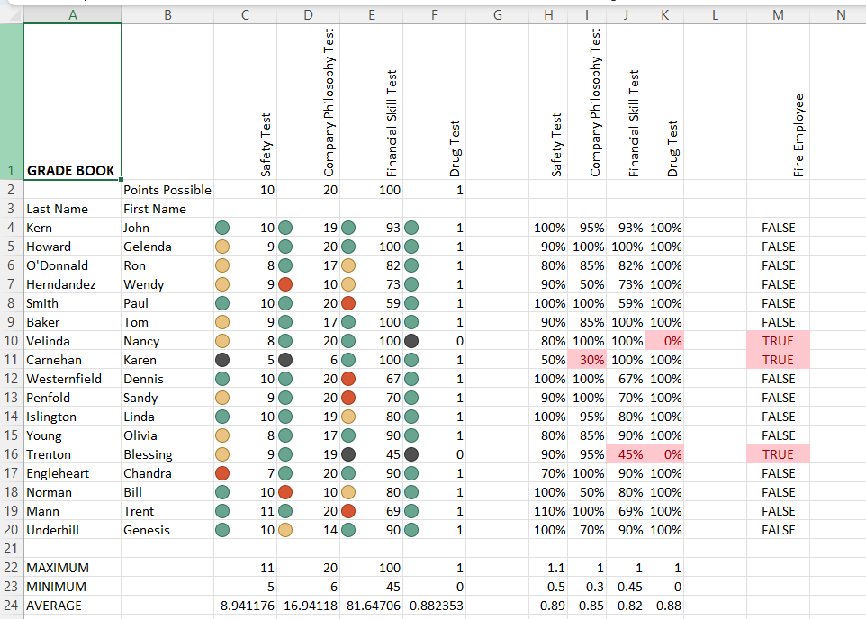

# GradeBook Management System (Excel Project)

## 📌 Overview
This project is developed using Microsoft Excel to manage student grades and performance efficiently.

## 📊 Features
- Student marks tracking
- Automatic grade calculation
- Use of Excel formulas
- Organized data structure

## 🛠 Tools Used
- Microsoft Excel

## 📂 Files Included
- GradeBook.xlsx

## 📈 Key Functions Used
- SUM()
- AVERAGE()
- IF()
- COUNT()

## 💡 Insights
- Helps analyze student performance
- Reduces manual calculation errors
- Easy grade management system

## 📸 Screenshots

## 👨‍💻 Author
GUNDA GOUTHAM
